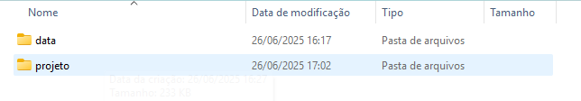
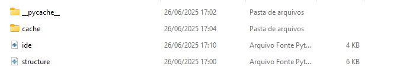
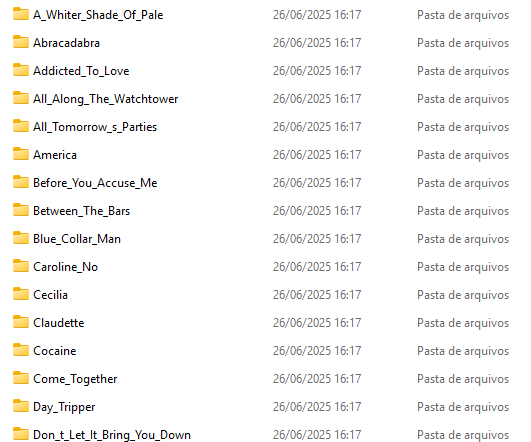

## Music Detection by Sound
Este projeto, Music Organizer, agrupa músicas por similaridade sonora usando extração de características de áudio com
Librosa, redução de dimensionalidade com PCA e agrupamento com KMeans. O sistema possui também
uma interface gráfica desenvolvida em PyQt5. Projeto desenvolvido para disciplina de Computação Científica e Análise de Dados.

## Visão Geral
O Music Organizer analisa arquivos de áudio .wav ou .mp3, extrai padrões sonoros e organiza músicas com som
parecido em grupos. Ideal para coleções de músicas, análise de covers e descoberta sonora.

## Funcionalidades
- Leitura automática de músicas em uma pasta
- Análise sonora com MFCC, cromas e contraste espectral
- Redução de dimensionalidade (PCA)
- Agrupamento em grupos similares (KMeans)
- Interface gráfica para selecionar pastas e músicas
- Visualização gráfica dos grupos

## Dataset Utilizado

Este projeto utiliza o seguinte dataset público do Kaggle: https://www.kaggle.com/datasets/arpanpathak/original-and-cover-song-pairs?resource=download

### Detalhes

Ao fazer o download do dataset, pode ser observado um arquivo WinRar que contem diversos dados e pastas que não utilizei. Em meu caso, extrai para a pasta do projeto apenas a pasta chamada covers32k e renomeei ela como data.
  
## Requisitos
```bash
Python 3.8 ou superior
librosa
scikit-learn
matplotlib
PyQt5
numpy
```

## Como Usar a Interface
```bash
python interface.py
```
Na interface, você poderá:
- Selecionar uma pasta com músicas WAV ou MP3
- Visualizar o agrupamento sonoro
- Analisar uma nova música para ver quais são parecidas

## Organização de Arquivos
 ```bash
 ide.py    # Interface gráfica
 structure.py    # Lógica de agrupamento
 data/
 Original Songs/
 Cover Songs/
```
 
## Documentação das Funções
OrganizadorMusical classe principal que analisa os áudios.
- extrair_caracteristicas() extrai vetores sonoros da música usando MFCC, chroma e contraste.
- carregar_musicas() percorre a pasta selecionada e carrega todas as músicas válidas.
- resumir_informacoes() aplica PCA para reduzir dimensionalidade.
- agrupar_musicas() aplica KMeans e cria os grupos.
- mostrar_mapa() exibe gráfico com os grupos de músicas.
- sugerir_musicas_parecidas(caminho) mostra as 5 músicas mais similares de acordo com o som.

## Como Contribuir
1. Faça um fork do projeto
2. Crie uma branch (git checkout -b minha-feature)
3. Commit suas mudanças (git commit -m 'Adiciona nova feature')
4. Push para o repositório (git push origin minha-feature)
5. Abra um Pull Request

## Licença
Distribuído sob a licença MIT. Veja LICENSE para mais informações

## Imagens
Exemplo de como organizei a pasta do projeto:


Dentro da pasta Projeto:

Dentro da pasta Data

